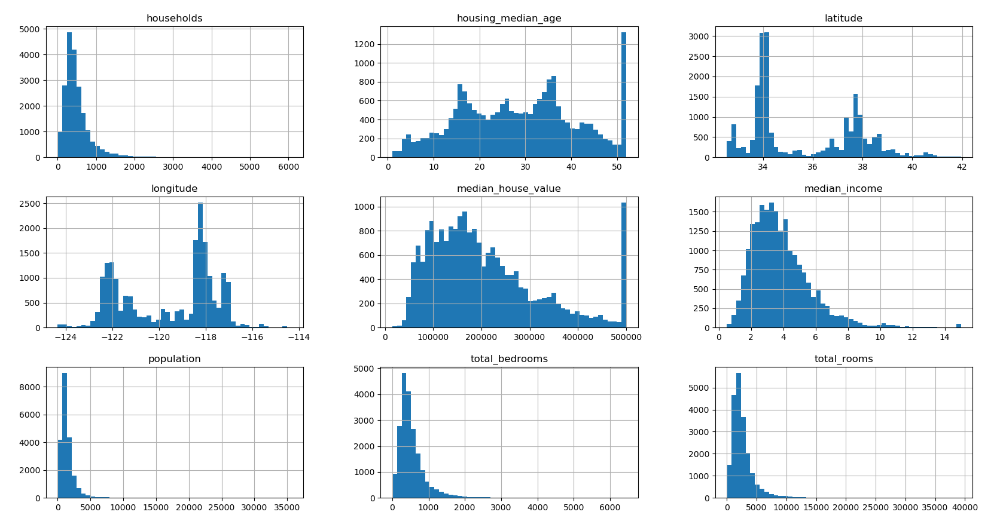
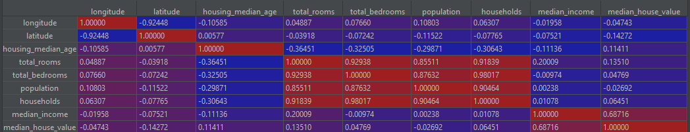

# The 22 Knesset Election Results Data Exploration

#### -- Project Status: Active

## Project Intro/Objective


### Methods Used
* Inferential Statistics
* Data Visualization


## Data Acquisition
The California Housing Prices dataset from the StatLib repository, based on the 1990 California census.
a. This data has metrics such as the population, median income, median housing price, and so on for each block group in California. Block groups are the smallest
geographical unit for which the US Census Bureau publishes sample data (a block
group typically has a population of 600 to 3,000 people).
 We will just call them “districts” for short.

I end up using the Hands-On Machine Learning with Scikit-Learn & TensorFlow
book dataset example, containing an additional categorical attribute (ocean approximation)
and artificially added missing values.


## Data Exploration

### First Glance Over the Features
Each record (row) in the dataset represent a district in California and hold the
 following  information:

* longitude
* latitude
* housing_median_age
* total_rooms
* total_bedrooms
* population 
* households - total number of household in district 
* median_income ranging from 1- to 15  (in 10k usd)
* median_house_value
* ocean_proximity - categorical feature with 5  unique values.
    

As a first step, we will examine each of the features separately, looking for 
outliers, errors, and missing values.

* Total of 20640 samples in the dataset, only the total bedrooms feature has 
missing values (added artificially).

* Longitude, latitude and house median age all contained in relative small value
 range, without abnormal values and with relatively small variance.

#picture of desribe data


Moving forward to the number of households, we detect a few irregularities:
* A mean of 499.54 with high std of 382.32.
  * A minimum value of a single household per district and a maximum of 6082.
  Districts with such a small number of households appear irregular.
  * In a real-life situation, I would consult with the client\ domain expert team
   regarding these cases. In this solo project, I decided to experiment with both removing
    and keeping these districts.
  * The bottom 0.25% of districts hold a total number of  < 47.6 households, 
     that would be a moderate spot to initiate samples cut-offs.
     
* A glance over other features values on these districts, we can easily examine
   that population, total bedrooms and total rooms showcasing very small values
    as well, suggesting a high correlation between these variables groups and a 
    potential feature reduction on later phases of the analysis.
    
* A few districts posses a significantly higher number of households/total rooms/  etc.
  *  example like 47.6
  * In a real-life situation, I would consult with the client\ domain expert team,
   I decided to try both removing and keep these districts.


* At this step, it is essential to note that the removal of outliers will be
 made in a later stage.

### Features Histograms



* Sticking out, The median house age and the median house value (target feature) 
values were capped at 50 and 500000 respectively.

* In a real-life situation, the decision on how to proceed from here should be at the hands of the client team.
  Unless capped value samples are somehow re-evaluated (pricy and time-consuming task)
  the predictor will struggle coping with real-life examples crossing these caps.
  
*  Another option to overcome the situation is either to understand the predictor
  of new limitations, it will not be suited for high-value houses. The technical
  meaning of this decision is to either leave the data as is capped or remove
   the capped district records ( we will examine the two options).
 
* The high number outlier's discussed earlier are skewing the histogram shapes
 of population, total bedrooms, total rooms, and households! the right tail
  heavy features might interrupt with different ML algorithms.
 
* The attributes have very different scales, we will use standardization technique 
as part of the data-cleaning pipeline later on to handle that.


### Splitting into train and test datasets

Before moving on to further analyze the dataset, we obliged to split the data
 into 80% training and 20% test sets.
 
The reason is we cannot proceed with pattern recognition,  outliers cleaning, and
 feature transforming without the ability to properly test them later on.
 


### Correlation



* Clearly The subgroup of total_rooms, total_bedroom, population and household 
  is very correlated to each other, making most of those features a serious candidate
   for exclusion.
* The Median income is the only feature heavily correlated by itself to the target
 variable (median house value), the scatter plot of the correlation of this variable.
 
  
  
*  The strong correlation is indeed visible on the scatter plot.
* The house value cap is also very prominent on this plot.
* Softer caps lines of 450k and 350k USD house values across the X-axis can be
spotted. I decided to double-check with the topmost occurred house prices values:

    | House price    | Count    |
    |----------------|----------|
    | 500001  |  786 |
    | 137500  |   102 |
    | 162500  |   91 |
    | 112500  |    80 |
    | 187500  |    76 |
    | 225000  |    70 |
    | 350000  |    65 |
    | 87500   |    59 |
    | 150000  |    58 |
    | 175000  |    52 | 
    
    Besides the hard 500k house price cap none of the other values is overly represented.


### Attribute Combinations
    
One way to tackle the tight highly correlated group of features is combining
them:

* toal_rooms per district is not very informative by itself, it is also highly 
correlated to the total number of households without adding any new insight.  

   however, we can create "rooms_per_household" feature by dividing it
  by the number of households.  
   Logically, districts in different areas will
  accommodate populations with different needs and different rooms_per_household
   as a result.

      
* Same goes with total_bedrooms feature, we can divide it by total_rooms to create
   bedrooms_per_room, a potentially more telling feature.
  
* Last attribute combination is population_per_household.
 (taken from the hands-on ML book)
 
The corrleation of the newly created features between themselvs and the target house price feature:
   
 
A not nearly as high correlation between the newly created features  as in between the original features,
 while correlating much better to the target!.


## Data Cleaning

### Missing values

I decided to fill the missing total_bedroom values by the median, for now at least.

 
 ### Categorial Features
 
 A single feature ocean_proximity holds 5 unique values:
 [NEAR OCEAN, <1H OCEAN, ISLAND, NEAR BAY, INLAND]
 I transformed the feature into 5 one-hot encoding features.
 
### Feature Scaling
I Used  sklearn StandardScaler for our data due to the abondance of outliers datapoints.
Might check normlization later on if I end up cutting off most of the outliers districts.


## Exploring Different Models

### The Current Data Transformation Pipeline & DataSet

At this point the data transformation pipeline consist of:
     

**The current final training dataset contains 16 total columns:**
* The original features described at the start of Data Exploration, minus
  ocean_proximity, (total of 9 features).
* Five new one-hot encoding features replacing ocean_proximity.
* Three new combined features described in the attribute combinations section.

### Models Chosen For Initial Testing
Based on scikit learn ml map:
   
 
* I Added both Lasso and ElasticNet models to the initial testing.
 Both of the models works well for the sparse dataset ( which is partially our case
  due to the one-hot encoding). 
     
  Elastic net specifically useful when there are multiple features which 
are correlated with one another.  
 
* I added Decision Trees since they are easy to use, extremely versatile, and fast. They allow viewing the output decision tree predictor as well.

* K Nearest Neighbor regressor makes logical sense from a basic meta business perspective,
 houses similar based on our features (eg. location\ income\ total rooms) might have a similar price.
 
 
* I minimally tested SVR (with RBF kernel) and MLPRegressor, for the sake of
 identifying a non-linear relationship.  
These models tend to require a large amount of hyperparameters tweaking, so chances are they won't be able to compete with other algorithms just yet.

* I decided to test Kernel Ridge as well, a similar predictor to SVR with a different loss function.
 
 
 ####Ensemble methods
 
* Random forests are a great model to overcome decision tree overfitting and to handle outliers as well.
 They are also useful for feature selection (will be one of our next steps).
   
* ExtraTreesRegressor are similar to random forests but with randomly chosen
 thresholds for each candidate feature (and the best thresholds are chosen)
 This usually allows reducing the variance of the model a bit more, at the
  the expense of a slightly greater increase in bias.
    
*  Gradient Boosted Decision Trees (GBDT) which produces a prediction model in
 the form of an ensemble of weak prediction models, typically decision trees.
  I used the default least square loss function at this stage.
    
    
Finally, I added the HuberRegressor model, a robust ridge regression that works
 well in the presence of outliers.
Moreover, the model output consists of a boolean mask classifying each sample as
 outlier or not.

### Initial Results
Models were tested using 10-fold cross validation on the train data set.


* The Three Ensembles models are at the top of the performance table.
 As expected ExtraTreesReg is less variant than the random forest but with
  slightly higher error.

* Somewhat surprisingly our very simplified logic regarding the KNN model proved
itself, the model performed notably better than the other candidates.

**Based on the initial testing results, the top 4 models were chosen for
 the rest of the project**
 
I will revisit the full list of predictors later on if I decided to clean the
dataset differently. 


Lucky for us, the top performer model (RandomForestRegressor) also excels
in discovering features relationship with the target value
and the degree of influence they have.


First, We will fine-tune our the RandomForestRegressor Using sklearn GridSearchCV.

As a first step, I chose rather simple parameter gridsearch: 
 ```python
param_grid = [
    {'n_estimators': [25, 30, 40,60,80,100, 120, 150], 'max_features': [3,4,6,8,10]},
     {'bootstrap': [False], 'n_estimators': [3, 10,30, 50, 75, 100],
      'max_features': [2, 3, 4, 6, 8,10]},
    ]
 ```
**The top performers of the  basic grid parameter search are:**
  
  
 
* We managed to reduce the error from 50196 into 48493!
* All top performers parameters combination  were on the top end of the estimators
 range, We should defeantly try gridsearch againan higher estimators number.
* Non-boostrap runs were on top of the performance list.


Before jumping into conclusions, lets re run the gridsearch with higher estimators range,
trying different max_deph values and double checking on the max_features parameter:  

 ```python
    param_grid = [
         {'bootstrap': [False], 'n_estimators': [450, 500, 600,700, 850],
          'max_features': [6, 8,10,'auto', 'sqrt' ],
                'max_depth': [10, 20,40,  60,None]}
    ]
 ```


**The top performers of the  basic grid parameter search are:**

    
* Elevating the numbers of estimators did manage to slightly improve the results.
* maximum features per tree split will be set to 6 parameters.
* max depth isn't as important, will be set to 20.

* Best estimator out of the second grid search is :  
 RandomForestRegressor(bootstrap=False, max_features=6, n_estimators=600)
 with a RMSE = 48132.99.


### Against The Test Set - V1

Predicting the test set yield error : **RMSE =64519.434255026106** very high error ,specially
compared to the training set error, which imply either overfitting of the model
 to the train data or another underlying problem.

After some tweaking of the different pipeline options I discover that the 
standardization caused the very high error on the test set.
By removing it the RMSE on the test set was lowered to **46139.80012933373**.

The reason is scaling using the mean and variance of the data is likely to not
work very well if the data contains many outliers thats our situation since we didn't
remove any of the districts with capped values.

#### Conclusions
Our options are either to remove standardization all together, use sklearn RobustScaler
that might be able to handle outlisers, or remove the outliers themselvs.

I thoroughly tested the first two pipeline modifications versus the  different 
initial models options and our current result without standardization is currently the best.


## Feature Selection
**Feature importance from the best performing RandomForestRegressor estimator:**

 
    
 * In yellow, the highly correlated original group of features, the source for
  the Attribute Combinations step. These four features turn out to be of very
   low importance, we should consider removing them.
* In red, the features added in the Attribute Combinations step, they all appear 
to be relatively important.

* Out of the 5 hot encoding features created from the ocean proximity feature,
 only NEAR OCEAN proved to be impactful, removing the rest of them.
 
#### Removing Features & Re-Evaluating Predictors

* I tested the removal of the bottom 8 features.
* Both with and without standardization, the initial predictors group performance
 order was the same, but with sligthly worse results.
* Sames goes with the fine tuned RandomForestRegressor predictor, results were
 slightly worse during the tunning and on the test set.
 
 
 ## Removing Outliers
 
 
 


- small number of households deletion
- fat tails deletion
- capped value deletion
