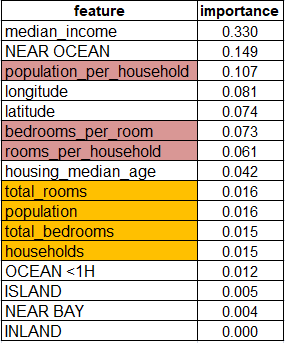
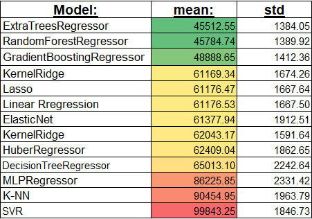

# Median House Prices For California Districts Derived From The 1990 Census.

#### -- Project Status: Active

## Project Objective

The project objective is the prediction of the median housing value of each  
block (district) in the state of California.


### Methods Used
* Inferential Statistics
* Data Visualization
* Data cleaning Pipelines
* Different ML Predictors
* GridSearch & RandomizeSearch Fine Tuning


## Data Acquisition
The California Housing Prices dataset from the StatLib repository, based on   
the 1990 California census.  
This data has metrics such as the population, median income, median housing price,  
 and so on for each block group in California.  
 Block groups are the smallest geographical unit for which the US Census Bureau  
  publishes sample data (a block group typically has a population of 600 to 
  3,000 people).  
 We will just call them “districts” for short.

I used the Hands-On Machine Learning with Scikit-Learn & TensorFlow book dataset  
version, containing an additional categorical attribute (ocean approximation)  
and artificially added missing values.


## Data Exploration

### First Glance Over the Features
Each record (row) in the dataset represent a district in California and hold the  
 following  information:

* longitude
* latitude
* housing_median_age
* total_rooms
* total_bedrooms
* population 
* households - total number of household in district 
* median_income ranging from 1- to 15  (in 10k usd)
* median_house_value
* ocean_proximity - categorical feature with 5  unique values.
    

As a first step, we will examine each of the features separately, looking for   
outliers, errors, and missing values.  
  

* Total of 20640 samples in the dataset, only the total bedrooms feature has   
missing values (added artificially).

* Longitude, latitude and house median age all contained in relative small value  
 range, without abnormal values and with relatively small variance.
 
* total_rooms, total_bedrooms, population, and households all have high variance.  
 notably, the 75% percentile is significantly lower compared to the maximum value  
 in all four feature, I will delve into this matter later on.

    * On the other end of this 4 features statistics, we spot the same difference  
between the minimum value to the 25% percentile value. 
         
    * Looking on the data table itself, it is easily spotted that this four features  
     are highly correlated and a potential feature reduction on later phases   
     of the analysis might be possible.
    

### Features Histograms


* Sticking out, The median house age and the median house value (target feature)   
values were capped at 50 and 500000 respectively.

* In a real-life situation, the decision on how to proceed from here should be   
at the hands of the client team.  
  Unless the capped value samples are somehow re-evaluated (pricey and time-consuming task)   
  the predictor will struggle coping with real-life examples crossing these caps.
  
*  Another option is to accept the predictor limitations, I will remove all capped  
  district samples from the dataset and as a result the predictor will not posses  
  any high median house value (target label) district samples available for training. 

 
* The high number outlier's discussed earlier are skewing the histogram shapes  
 of population, total bedrooms, total rooms, and households! the right tail  
  heavy features might interrupt with different ML algorithms.  
  I will test correcting and removing the outliers.
 
* The attributes have very different scales, I will test different standardization  
 technique as part of the data-cleaning pipeline later on to handle that.


### Splitting Into Train And Test Datasets

Before moving on to further analyze the dataset, we obliged to split the data  
 into training and test sets ( 80% vs 20% in our case).
 
The reason is we cannot proceed with pattern recognition, outliers cleaning, and  
 feature transforming without the ability to properly test them later on.
 
### Correlation


* The subgroup of total_rooms, total_bedroom, population and household is very  
 correlated to each other, making most of those features a serious candidate
   for exclusion.
* The Median income is the only feature heavily correlated by itself to the target  
 variable (median house value), the scatter plot of the correlation of this variable.
 
  
  
*  The strong correlation is indeed visible on the scatter plot.
* The house value cap is also very prominent on this plot.
* Softer caps lines of 450k and 350k USD house values across the X-axis can be  
spotted. I decided to double-check with the topmost occurred house prices values:

    | House price    | Count    |
    |----------------|----------|
    | 500001  |  786 |
    | 137500  |   102 |
    | 162500  |   91 |
    | 112500  |    80 |
    | 187500  |    76 |
    | 225000  |    70 |
    | 350000  |    65 |  
    
    

    
   * Besides the hard 500k house price cap none of the other values is overly represented.


### Attribute Combinations
    
One way to tackle the tight highly correlated group of features is combining
them:

* total_rooms per district is not very informative by itself, it is also highly   
correlated to the total number of households without adding any new insight.  

   However, we can create "rooms_per_household" feature by dividing it
  by the number of households.  
   Logically, districts in different areas will accommodate populations with   
   different needs and different rooms_per_household as a result.

      
* Same goes with total_bedrooms feature, we can divide it by total_rooms to   
create bedrooms_per_room, a potentially more telling feature.
  
* Last attribute combination is population_per_household.  

 
The corrleation of the newly created features between themselvs and the target house price feature:
   
 
A not nearly as high correlation between the newly created features  as in between  
 the original features, while correlating much better to the target!.

This feature combination was taken from  the hands-on ML book.
## Data Cleaning

### Missing values

I decided to fill the missing total_bedroom values by the median.

 
 ### Categorial Features
 
 A single feature ocean_proximity holds 5 unique values:  
 [NEAR OCEAN, <1H OCEAN, ISLAND, NEAR BAY, INLAND]  
 I transformed the feature into 5 one-hot encoding features.
 
### Feature Scaling
I Used  sklearn StandardScaler for our data due to the abondance of outliers datapoints.
Might check normlization later on if I end up cutting off most of the outliers districts.


## Exploring Different Models

### The Current Data Transformation Pipeline & DataSet

**At this point the data transformation pipeline consist of:**  
     

**The current final training dataset contains 16 total columns:**
* The original features described at the start of Data Exploration, minus
  ocean_proximity, (total of 9 features).
* Five new one-hot encoding features replacing ocean_proximity.
* Three new combined features described in the attribute combinations section.

Up until this point I **did not** test the following options:
* The removal of capped target (house_median_value) values.
* Removal or correction of outliers and house median age capped feature.
* Using normalization instead of standardization or none of the two.
* Removal of not signifigant features. 

### Models Chosen For Initial Testing
Based on scikit learn ml map:
   
 
* I Added both Lasso and ElasticNet models to the initial testing.  
 Both of the models works well for the sparse dataset ( which is partially our  
 case due to the one-hot encoding).
     
  * Elastic net specifically useful when there are multiple features which   
are correlated with one another.  
 
* I added Decision Trees since they are easy to use, extremely versatile, and  
 fast. They allow viewing the output decision tree predictor as well.

* K Nearest Neighbor regressor makes logical sense from a basic meta business  
 perspective, houses similar based on our features (eg. location\ income\   
 total rooms) might have a similar price.
 
 * I minimally tested SVR (with RBF kernel) and MLPRegressor, for the sake of  
 identifying a non-linear relationship. These models tend to require a large  
  amount of hyperparameters tweaking, so chances are they won't be able to  
   compete with other algorithms just yet.

* I decided to test Kernel Ridge as well, a similar predictor to SVR with a  
 different loss function.
 
 
 ####Ensemble methods
 
* Random forests are a great model to overcome decision tree overfitting and  
 to handle outliers as well. They are also useful for feature selection   
 (will be one of our next steps).
   
* ExtraTreesRegressor are similar to random forests but with randomly chosen  
 thresholds for each candidate feature (and the best thresholds are chosen)  
 This usually allows reducing the variance of the model a bit more, at the  
  the expense of a slightly greater increase in bias.
    
*  Gradient Boosted Decision Trees (GBDT) which produces a prediction model in  
 the form of an ensemble of weak prediction models, typically decision trees.  
  I used the default least square loss function at this stage.
    
    
Finally, I added the HuberRegressor model, a robust ridge regression that works  
 well in the presence of outliers.  
Moreover, the model output consists of a boolean mask classifying each sample as  
 outlier or not.

### Initial Results
Models were tested using 10-fold cross validation on the train data set.


* Expected ExtraTreesReg is less variant than the random forest but with  
  slightly higher error.

* Somewhat surprisingly our very simplified logic regarding the KNN model  
 proved itself, the model performed notably better than the other candidates.

I will revisit the full list of predictors on a later testing cycle. 

Lucky for us, the top performers models (RandomForestRegressor and  
 ExtraTreesRegressor) also excels in discovering features relationship with the  
  target value and the degree of influence they have.


First, I will fine-tune our the RandomForestRegressor Using sklearn GridSearchCV.

As a first step, I chose rather simple parameter gridsearch: 
 ```python
param_grid = [
    {'n_estimators': [25, 30, 40,60,80,100, 120, 150], 'max_features': [3,4,6,8,10]},
     {'bootstrap': [False], 'n_estimators': [3, 10,30, 50, 75, 100],
      'max_features': [2, 3, 4, 6, 8,10]},
    ]
 ```
**The top performers of the basic grid parameter search are:**  
  
  
 
* The error was reduced from 50196 to 48493.
* All top performers parameters combinations were on the top end of the estimators  
 range, I will defiantly try gridsearch again with an higher estimators range.  
* Non-boostrap runs were on top of the performance list.

Before jumping into conclusions, lets re run the gridsearch with higher estimators  
 range, trying different max_deph values and double checking on the max_features  
  parameter:  

 ```python
    param_grid = [
         {'bootstrap': [False], 'n_estimators': [450, 500, 600,700, 850],
          'max_features': [6, 8,10,'auto', 'sqrt' ],
                'max_depth': [10, 20,40,  60,None]}
    ]
 ```


**The top performers of the  basic grid parameter search are:**  

    
* Elevating the numbers of estimators did manage to slightly improve the results.
* Maximum features per tree split will be set to 6 parameters.
* Max depth isn't as important, will be set to 20.

* Best estimator out of the second grid search is:  
 RandomForestRegressor(bootstrap=False, max_features=6, n_estimators=600)  
 with a RMSE = 48132.99.


## Against The Test Set - V1

Predicting the test set yield error : **RMSE =64519.434255026106** very high error,  
specially compared to the training set error, which imply either overfitting of  
 the model to the train data or another underlying problem.

After some tweaking of the different pipeline options I discover that the  
standardization caused the very high error on the test set.  
By removing it the RMSE on the test set was lowered to **46139.80012933373**.

The reason is scaling using the mean and variance of the data is likely to not  
work very well if the data contains many outliers. thats our situation since we   
didn't remove any of the districts with capped values.

#### Conclusions
Our options are either to remove standardization all together, use sklearn  
 RobustScaler that might be able to handle outlisers, or remove the outliers  
  themselvs.

I thoroughly tested the first two options versus the  different initial models  
 options and our current result without standardization is currently the best.


## Feature Selection
**Feature importance from the best performing RandomForestRegressor estimator:**

 
    
 * In yellow, the highly correlated original group of features, the source for  
  the Attribute Combinations step. These four features turn out to be of very  
   low importance, we should consider removing them.  
* In red, the features added in the Attribute Combinations step, they all appear   
to be relatively important.

* Out of the 5 hot encoding features created from the ocean proximity feature,  
 only NEAR OCEAN proved to be impactful, removing the rest of them.
 
#### Removing Features & Re-Evaluating Predictors

* I tested the removal of the bottom 8 features.
* Both with and without standardization, the initial predictors group performance  
 order was the same, but every predictor had slightly worse results.
* Sames goes with the fine tuned RandomForestRegressor predictor, results were  
 slightly worse during the tunning and on the test set.
 
  
 ## Handling Outliers and Capped Features Labels
 
 ### Capped Target House Median Value
 As explained in the data exploration section The feature house_median_age and  
  the **prediction target** median_house_value values are capped.  
    
   
  * Another way to view the capped target variable values:  
    Top occurring median_house_value values:
     
    | Value    Count |
    |---------------|
    | 500001\.0    965 |
    | 137500\.0     122 |
    | 162500\.0     117 |  
   
Although altering the whole dataset (with emphasis on the test set) is usually  
 incorrect, the bias towards the capped target values will teach the predictor  
  that house values never cross the capped value.    
  
  (Re-evaluating the median house value district labels is out of this project    
  scope).
  
* An initial transformer cleaning step was added before the split into train/test  
 sets to remove all districts with capped target variable.
* A total of 965 districts were removed. The full dataset shrink from 20640  
district into 19675.


### Initial Model Testing Version 2
   

* Most of the models mean error reduced by a very large margin.
* K-NN preforms much worse after the removal of the capped target samples
* RandomForests & ExtraTrees ensembles models still leading the chart, I will  
 focus on fine tuning this two models only.
  
**It is safe to determine at this stage the capped target features values will  
be removed.**
  
  

#### Fine Tuning Top Models Version 2   


##### <ins>RandomForestRegressor</ins>

Simple RandomForestRegressor tuning result in the best estimator to be: 
   


**The Best RandomForestRegressor Estimator error on the test set is 42305.31**


##### <ins>ExtraTreeRegressor</ins>
Simple ExtraTreeRegressor tuning result in the best estimator to be:  
(Note here: Fine tunning of version 3 was conducted before version 2, that why    
this ExtraTreeRegressor fine tuning did not include a lot of options )  
      

First time I tried max_feature = 7 and its top the performance table, same with  
min_samples_split=3. I will try this combinations later on future versions.

**The best ExtraTreeRegressor estimator feature importance:**  
      

**The Best ExtraTreeRegressor best estimator error on the test set is 43665.19863641184**

That is a really big improvement on the test set for ExtraTreeRegressor.

   
   


  
  
  
  
  
  
 ### Capped Feature House Median Age
 
     

A total of 1103 districts with capped median_house_age left after the removal of  
the capped target feature. 
 
Since median_house_age is not the target label, I remove capped values only from  
the train set only. Overall 895 district were removed from the training set  
Reducing it from 15740 to 14845.

   
#### Initial Model Testing Version 3

Testing the top 3 models after the removal of capped median_house_age districts  
produced even lower error on the train set: 

     
   
I will test the performance on the test set before the final decision to remove
the capped median age values or not.
 
 
#### <ins>Fine Tuning Top Models Version 3</ins>

At this stage after a significant improvement on the train set  
I want to find the best parameters before predicting the test set.

#### <ins>RandomForestRegressor Fine Tuning</ins>

A basic grid parameter search based on the earlier grid search best results:  
 ```python
    param_grid = [
         {'bootstrap': [False, True], 'n_estimators': [600, 125, 500 , 200],
          'max_features': [ 6], 'min_samples_split': [10], 'min_samples_leaf': [ 4],
          'max_depth' : [20]
          },
    ]
 ```

The best parameter combination chosen with **mean error 44239.75**:  
  ```python
RandomForestRegressor(bootstrap=False, max_depth=20, max_features=6,
                      min_samples_leaf=4, min_samples_split=10,
                      n_estimators=600)	
 ```


Feature importance of the best estimator:    
  
 

 
 **The Best RandomForestRegressor Estimator error on the test set is 42708.52**
 
 #### <ins>ExtraTreeRegressor Fine Tuning</ins>
 
 It is time to start fine tuning the other top 2 models as well,  
 starting from the ExtraTreeRegressor. As in the random forest models, the most  
 important parameters to tweak are n_estimators and max_features.  
 The max_features works slightly different than in random forest:  
 
   ```python
    param_grid = [
         { 'n_estimators': [600, 125, 500 , 200],
          'max_features': [ "auto", "sqrt", "log2", 6], 'min_samples_split': [2,6,10], 'min_samples_leaf': [1, 4],
          'max_depth' : [20]
          }
    ]
  ```
The top parameters combination:  
  
 
 
 
Feature importance by the best ExtraTreeRegressor estimator:    
  
   
Very similar to the random forest estimator feature importance. 
 
**The Best ExtraTreeRegressor Estimator error on the test set is 49005.977**
 
 
 
 
## Capped Values Handling Conclusion
 
I tested the removal of the two different capped features:  

#### House Median Value

* The model target house_median_value was capped at 500001.0, meaning any district  
 with higher houses median value was set to 500001.0.  
  This very biased dataset that would mislead predictors to conclude the target  
   value never pass 500001.0.
* Removing districts with the capped target value reduced the error on the test  
  set significantly in both tested models.
* It is important to note the model did have any district samples with higher   
house median value to learn from, and will probably preform bad on them.
  
#### House Median Age  

* The house median age was also capped at 52.0, meaning any district with higher  
median houses age was set to 52.0.
* The phenomenon is on a much smaller scale, most districts houses median age   
  are not over 50 years old (would of consult a domain expert about this issue).
* Removing the capped values from the training set had an insignificant impact  
on the test set error.
* I decided to keep the capped districts in the dataset.
  
  
  
 ## Handling Outliers
 
 ### Examine Test Set Error V2
 
 explore_test_error script allow us to look on the error of each of the districts
 on the test set.
 
 Comparing the statistics of the worst 250 district by error compare to the complete
 test dataset:
 
  
  
 In orange, values that are lower in worst 250 districts by error on the test set.  
 In blue, values that are higher.  
 * The four original grouped features (total_rooms to households) hold lower values  
  in the worst 250 districts dataset.    
 * On the contrary, median_income, rooms_per_household, together with the actual  
  real district house median value are higher on the worst 250 erroneous districts.  
    * As I concluded on the last section, the model will handle high house value  
    districts poorly since it lacks training samples.
   * The ISLANDS tagged district are less represented in the worst 250 districts.

 
 ### HuberRegressor Outliers Statistics
 
 One of the HuberRegressor model main features is the classification of each    
  sample as outlier or not.   
  The model default parameters returned a very loosen outliers classification,  
  tuning the epslion parameter to 2.5 resulted in only 872 outliers classified.

* The statistics of HuberRegressor set were in agreement with the worst 250 districts    
 I presented earlier.   
  
  
 ### Removing Extreme High Values Outliers
 
The dataset feature histogram after the removal of capped house_median_value:  
 
 
* The features: **households, population, total_bedroom, and total_room**:
   * X axis is extended up to 5  fold due to individuals districts, for example  
   the total_rooms feature range sprea between 2 to 39320 with only 77 samples   
    above 16k or 249 districts above 10k (out of 20640 districts).  
  

*  Removal of the top 2.5% - 3% quantile for this 4 features cleaned the histograms:
    *   
    * Total of 656 outliers districts were removed during this process.


* I tested the performance versus the training set using the top 3 models and   
against the test set, the error is slightly worse than version 2 described   
earlier where I didn't remove any of the districts.


### Log Transforming Extreme Values Outliers

I tested sklearn PowerTransformer to handle this four feature outliers.  
PowerTransformer estimated the optimal parameter for stabilizing variance  
and minimizing skewness through maximum likelihood.      
   
 **Performing log transformation on the four features did not result in performance  
 improvement vs the training set nor versus the test set.**
 

   
   
### Combining The Two Options

  
  **The removal of extreme high value outliers together with PowerTransform the other   
  four features resulted in promising results without fine tuning the estimator yet:**  
  
 
   
   
  The general best random forest estimator from earlier tuning had 42562.75 error  
  on the test set.  
  
  #### RandomForest Fine Tuning
  Based on all earlier random forest fine tuning I have an idea for the ideal   
  values for most of the parameters, ( such as boostrap, number of estimators)  
  There still few parameters left to optimize:  
   
   ```python
    param_grid = [
        {'bootstrap': [False], 'n_estimators': [600],
         'max_features': [5, 6, 10], 'min_samples_split': [2, 3, 4],
         'min_samples_leaf': [1],
         'max_depth': [20, 35]
         },
    ]
  ```
 
   
**The Best estimator result on the test set is 42588**

**The training set fine tunning error and the best estimator error versus  
the test set are all worse than Version 2 erorr (were no district removal  
nor feature transformation were used)**


### Removing Extreme Low Values Outliers

* In the begining of this section I compared the statistics of the full test   
dataset and the bottom 250 error districts from the test dataset.    
  
* The four features in the question had lower mean values, suggesting testing  
for the removal of extreme low value outliers.  
  
* Another argument for the removal of low value outliers comes from a domain  
 knowledge perspective. Districts with 1, 2, or even 20 houses should not be   
 evaluated as a district (e.g calculating district median features values).  
   
 
 * In case a domain expert agrees with my last assessments we can remove  
 extremely small districts from the whole dataset, since we are not interested  
 in evaluating such small districts as part of the analysis.   

* Removing districts that are bottom 4.5%  of **households, population, total_bedroom,  
and total_room**:
     * total rooms < 665.
     * total bedrooms < 146.
     * households < 135.
     * population <371.64.  
     
   * (High numbers of the districts are shared between the cuts)  

**The last best estimator mean error on this data test is 40100.55, much lower than   
our currently estimator without fine tuning!**


 A deeper evaluation shows that cutting districts based on all four features is  
redundant. Cutting off districts based on either population or households is enough.  
  
Cutting only 4.5% (1093 districts) of the bottom population instead of 1490 districts  \
resulted in the same mean error over the test set.  

#### Fine Tuning RandomForest

Best estimator with mean error 40194.36 was:    
                                           
   ```python
 RandomForestRegressor(bootstrap=False, max_depth=70, max_features=6,
                                           min_samples_leaf=1, min_samples_split=2,  
                                           n_estimators=600)  
  ```

 


### Feature Scaling & Removal

#### Feature Removal
After the latest updates to our model (The removal of capped target feature  
values together with extreme small districts). I decided to test once again  
for different options of feature scaling and reductions.
 
Based on our latest best RandomForest estimator feature importance output  
I tested for the removal of bottom 3 and bottom 8 features.  Result show major  
decrease in estimator performance over the training set and the test set.

#### Feature Scaling

I tested the use of PowerTransformer for the group of features with large right-side   
tails and the use of StandardScaler for the others features that do not require
log transformation.  

Since our top 2 best estimator is RandomForestRegressor, feature scaling is not  
necessary and don't contribute for better results.
Moreover, scaling of the feature smooth the non linear realtionships between  
the different features that.