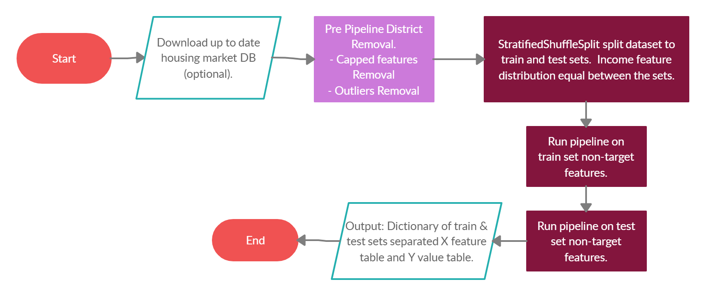
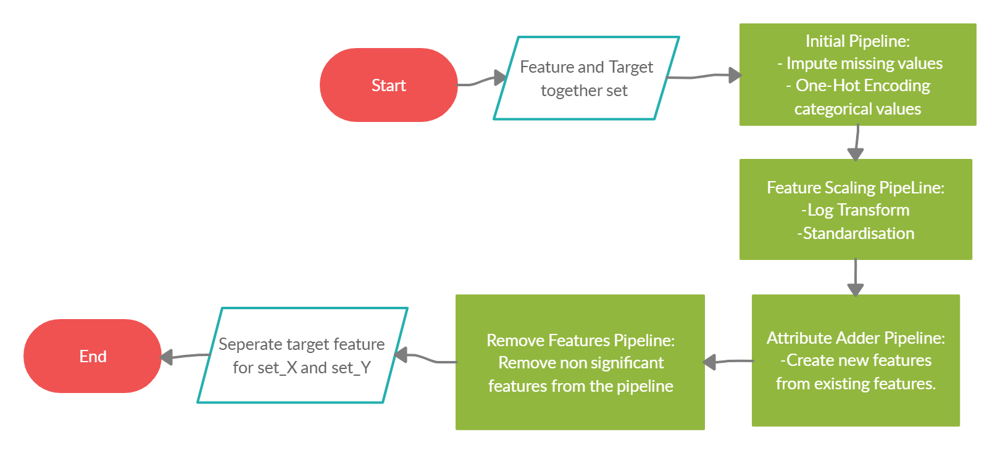

# Median House Prices For California Districts Derived From The 1990 Census.

### Summary & Results.

The final model predicts the median house value with a mean error of **40100**.  
A significant improvement over the hands-on machine learning book chapter on this  
data-set and over the majority of Kaggle kernels.  
  

(Not including Geospatial  feature engineering kernel, out of this project scope).  
  
  
The final model use RandomForestRegressor estimator, but the top three estimators  
were all ensemble methods.  

Random Forest was best fitted to the problem since:  
* The data contained both categorical and numerical features.
* The features were all on different ranges of values. 
* The data was somewhat noisy, large range of value between different  
districts in the same district.  
* Random forests can handle correlated features ( our case as I will   
present in the data exploration section).


The best performing RandomForestRegressor parameters:

 ```python
RandomForestRegressor(bootstrap=False, max_depth=70, max_features=6,
                        min_samples_leaf=1, min_samples_split=2,
                        n_estimators=600)
 ```


## Model

[build_model.py](../master/src/build_model.py) control the estimator building and prediction process.  

The data cleaning process wrapped in [pipeline_wrapper.py](../master/src/pipeline/pipeline_wrapper.py):
  

    

#### The Pipeline I run on the train & test sets separately non target features:



Complete control over every pipeline step, allowing swift changes to the process  
for testing can be found in [project_settings.py](../master/src/project_settings.py)

The settings right now produce the best estimator.
